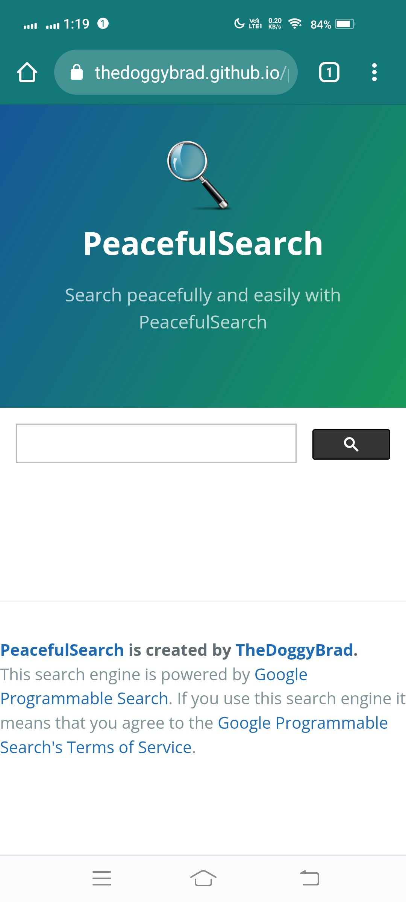
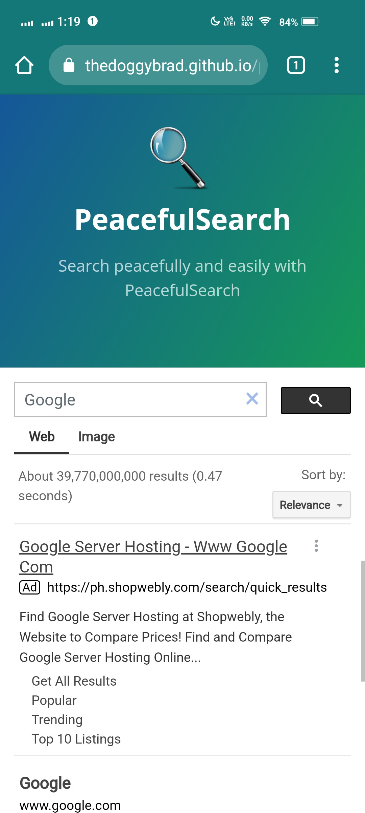
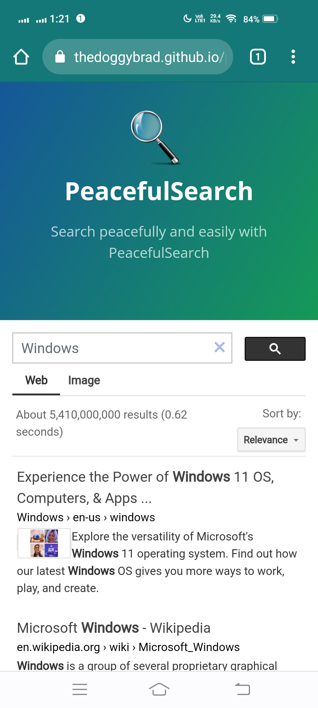

# PeacefulSearch
Search peacefully and easily with PeacefulSearch. Powered by Google.

## List of Features
•Compact UI Design
<br>
•Web Results
<br>
•Image Results
<br>
•The "No Adult Content Mode" is forcedly enabled by default
<br>
•Search across all regions
<br>
•A lot of search results (Powered by Google)
<br>
•Opens clicked search results into a new tab (Like the default of MS Bing on a PC) but ads open in the same tab.
<br>
•JavaScript of the Search Engine is native to the website itself (Not External)

## Official Access Links
https://thedoggybrad.github.io/peacefulsearch/
<br>
https://cutt.ly/peacefulsearch

## How this thing works?
This search engine is composed by 2 components:
<br>
•The Search Engine
<br>
•Graphical User Interface
<br>
<br>
The Search Engine is powered by Google's Programmable Search Engine running HTML and JavaScript. While, the Graphical User Interface was running under HTML and CSS, that is powered by Jekyll's Cayman Theme.
<br>
<br>
This means that everything you type and search is sent to Google. The search results are also from Google.

## Use of CDN
Critical files (CSS, JS and Favicon/Logo) is now using jsDelivr's CDN. This is done to provide a better experience to the end users.

## How to use?
1.) Go to the search engine thru the "Official Links".
<br>
2.) Click the search bar and type whatever you want to search.
<br>
3.) Click the search button and wait for the results to appear.
<br>
4.) Browse the search results. You may also choose between "Web" and "Image" results.

## Screenshots




## Privacy and Safety
This search engine is 100% safe. However, we are not liable for the safety of the links in the search results. Google might collect some non-personal information about you like your search history and IP Address.

## Advice for your own Safety
Always consult and follow the advice of your security software while using this search engine, as the safety of the search results are not guaranteed.

## How to use it on my own website?
To use PeacefulSearch on your own website, you can simply input this code on your website:
```
<script src="https://cdn.jsdelivr.net/gh/thedoggybrad/peacefulsearch@main/search.js">
</script>
<div class="gcse-search"></div>
```
This code simply adds the JavaScript used for this search engine and its HTML representative (Class).
You can use it on whatever you want. Make sure to just follow the [Programmable Search Engine Terms of Service] (https://support.google.com/programmable-search/answer/1714300?hl=en&ref_topic=4513742).

## Instructions for the PWA app installation (Works even you are offline)
1.) Mobile Browsers
<br>
-To install the app, just click the 3 dots (or similar on other browsers) then click Install App. 
<br>
<br>
2.) Desktop Browsers
<br>
-To install the app, you may click the share button on the address bar then click the download button
<br>
or
<br>
-To install the app, click the 3 dots or similar then go to More Tools and click Create Shortcut. Make sure to tick the option "Open in new window" or similar.
<br>
<br>
Note: To search thru the internet, you obviously need to be connected to the Internet. 
